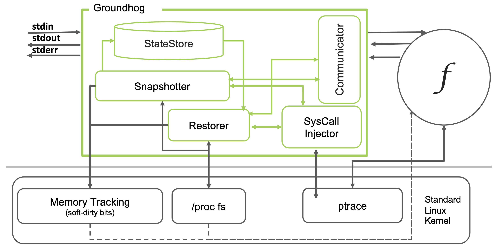

# Groundhog
A lightweight in-memory snapshot and restore tool.

### Project structure
- `src/` includes all source files and libraries 
- `tests/` includes functionality tests
- `Makefile`
    - `$ make gh` builds Groundhog for use in FaaS containerized runtimes (No sudo)
    - `$ make all` builds Groundhog and the testcases for functionality testing on standard linux
    - `$ make test` runs all functionality test cases

### Software requirements
- Linux Operating system. Kernel v3.11+ [^1]. We recommend using Ubuntu 20.04.

### Quick start
Starting on a fresh Ubuntu 20.04 image:
```
$ mkdir groundhog-evaluation; cd groundhog-evaluation; git clone https://gitlab.mpi-sws.org/groundhog/groundhog.git; cd groundhog
$ ./install_dependencies.sh #sudo apt-get install -y build-essential libglib2.0-dev
$ make test
```

### How it works
Groundhog starts the program in a child process and takes a snapshot by capturing the program's state (memory, threads, and CPU registers). Groundhog relies on standard linux SD-bits memory tracking, and the /proc file system to identify changes in the memory of the child process. Groundhog relies on ptrace to control the child process, and injects syscalls into the child process, forcing the reconstruction of the snapshotted memory layout and then overwrite any memory changes with the original content from the snapshot. Groundhog's primary use case is enforcing sequential request isolation in FaaS. In FaaS environments, the program is basically the runtime (Python/NodeJS/...) executing a simple code wrapper that invokes the tenant-provided function handler.

##### Groundhog Architecture


##### Initialization
To enforce request isolation in FaaS, Groundhog operates as a manager process that interposes between the FaaS platform and the process that runs the function.
The FaaS platform initializes the Groundhog manager process as if it were the process that will run the function. Groundhog forks a new process, prepares pipes for communicating with it, drops privileges of the child process, and execs the actual function runtime in the child process.

##### Snapshotting
To take a snapshot, the Groundhog interrupts the child process (the process running the FaaS function), then:
(a) stores the CPU state of all threads using ptrace;
(b) scans the /proc file system to collect the memory mapped regions, memory metadata, and the data of all mapped memory pages;
(c) stores all of this in the memory of Groundhog (the manager process);
and (d) resets the soft dirty bit memory tracking state. 

Finally, the manager resumes the funciton process, which then waits for the first request inputs.

##### Tracking state modifications
Groundhog uses the standard Soft-Dirty Bits (SD) feature of the Linux kernel (Available on stock Linux kernels v3.11+ [^1]), which provides a page-granular, lightweight
approach to tracking memory modifications.  Each page has an associated bit (in the kernel), initially set to 0, that is set to 1 if the page is modified (dirtied).  When a function invocation completes, Groundhog scans the SD-bits exposed by the Linux /proc filesystem to identify the modified pages.  After restoring the
function process, Groundhog resets all SD-bits to 0, ready for the next invocation.

##### Restoring to the snapshotted state
When a function invocation completes, the function process returns the
result to the Groundhog manager.  Groundhog's manager awaits the function
response and forwards it to the FaaS platform (which inturn sends it to
the caller). Next, the manager interrupts the function process and
begins a restore.  The manager identifies all changes to the memory
layout by consulting `/proc/pid/maps` and `pagemap`
(e.g. grown, shrunk, merged, split, deleted, and newly created memory regions);
these changes are later reversed by injecting syscalls into the function process using
`ptrace`.  The manager restores
brk, removes added memory regions, remaps removed memory
regions, zeroes the stack, restores memory contents of pages that have
their SD-bit set, madvises newly
paged pages, restores registers of all threads,  and finally resets SD-bits.

After restoration completes, 
the child process is in an identical state to when it was snapshotted, 
and the process is ready to handle the next request.  

##### Enforcing request isolation
Groundhog enforces request isolation by design. Groundhog prevents
new requests from reaching the function's process until it has been
restored to a state free from any data of previous requests. This is
achieved by intercepting the end-client requests before they reach the
function and buffering them in Groundhog until the function's process
has been restored.

Although intercepting the communication ensures control
of the function process and enforces confidentiality, it can add an overhead
of copying request input/outputs to and from Groundhog's manager
process. This overhead can be eliminated as follows: (1) The FaaS
platform can forward inputs directly to the function process after
waiting for a signal from Groundhog's manager process that the function
has been restored to a clean state. This requires minor, but trusted
changes to the FaaS platform to wait for the signal from Groundhog. (2)
Upon completion of a request, the function process can return
outputs directly to the FaaS platform and, separately, signal Groundhog's
manager process that its state can be rolled back. The changes
needed can be made in the I/O library that handles communication with the platform in the function process (no
changes needed to the code of the individual functions submitted by the developers) and the changes
do not have to be trusted for confidentiality -- if the function
process fails to signal Groundhog that it is done, Groundhog will never
restore the state and will never signal the platform to send the
next request.

We implemented (2) to facilitate debugging. Our evaluation still intercepts all inputs and outputs to demonstrate that platform modifications were not required and show the overhead of such interception on various functions.

### Citation
Please use the following citation:
```
@inproceedings{groundhog,
  title= {Groundhog: Efficient Request Isolation in FaaS},
  author= {Alzayat, Mohamed and Mace, Jonathan and Druschel, Peter and Garg, Deepak},
  booktitle={To Appear: Proceedings of the Eighteenth European Conference on Computer Systems (EuroSys '23)},
  year={2023}
}
```

[^1]: We identified and reported a bug that affected the accuracy of the SD-Bits memory tracking in v5.6, it was fixed in
v5.12 (details and a buggy kernel detector [here](https://lore.kernel.org/linux-mm/daa3dd43-1c1d-e035-58ea-994796df4660@suse.cz/T/))
